<p align="center">
  <a href="https://offersdk.com">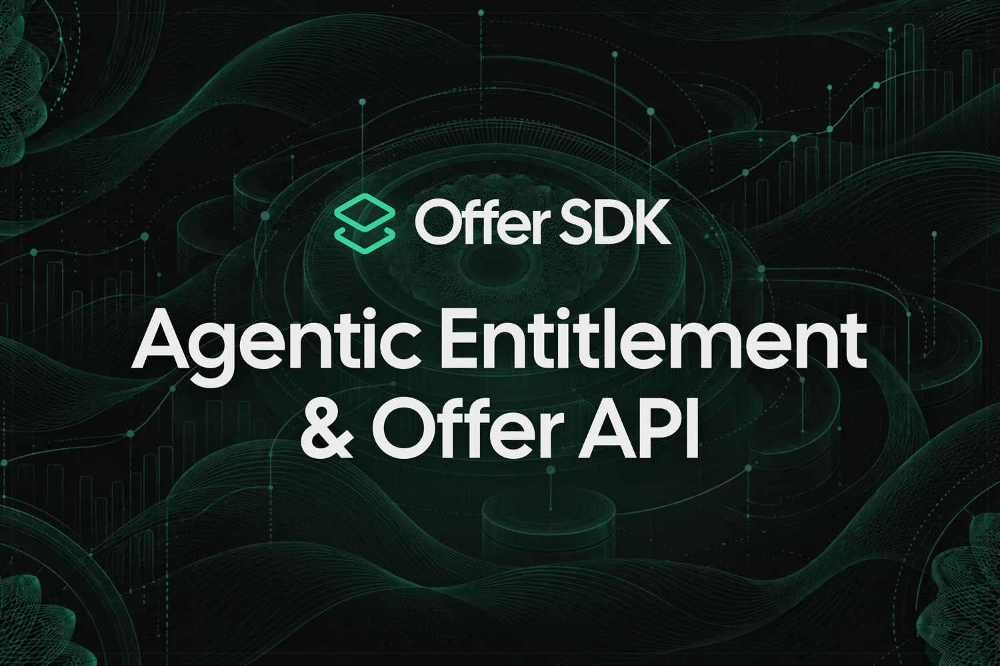</a>
</p>

<h3 align="center">Pricing changes shouldn't need a pull request.</h3>

<p align="center">
  Offer SDK pulls plans, access and offers out of your code, runs on your own Render account and bills through PayPal.<br>
  Launch a deal or test a price from the dashboard, with no deploy.
</p>

<p align="center">
  <a href="https://offersdk.com"><b>Website</b></a> ·
  <a href="https://app.offersdk.com/sign-in"><b>Demo workspace</b></a> ·
  <a href="https://offersdk.com/docs"><b>Docs</b></a> ·
  <a href="https://www.youtube.com/watch?v=TUMjnmfsPeM"><b>Video</b></a> ·
  <a href="https://offersdk.com/docs/sponsors/postman"><b>Postman</b></a>
</p>

<p align="center">
  <a href="https://render.com/deploy?repo=https://github.com/impactvelocity/offer-sdk"></a>
</p>

<p align="center">
  
  
  
  
  
  
</p>

---

<p align="center">
  <a href="https://www.youtube.com/watch?v=TUMjnmfsPeM">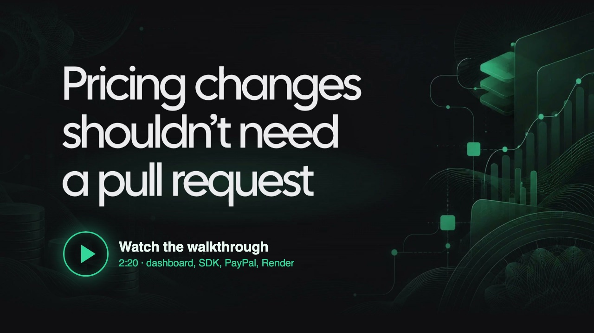</a>
</p>

## Why this exists

Every custom deal turns into an `if` statement. One customer wants a longer trial, another wants more seats, an affiliate wants a package for their audience by Friday. Each yes means more billing code and another deploy. A few months in, nobody remembers which customer has which deal, and nobody can tell which features actually make money.

Offer SDK decouples the code from offers, packaging and access. Your app asks one question, **what can this user do?**, and the answer comes from an API you control.

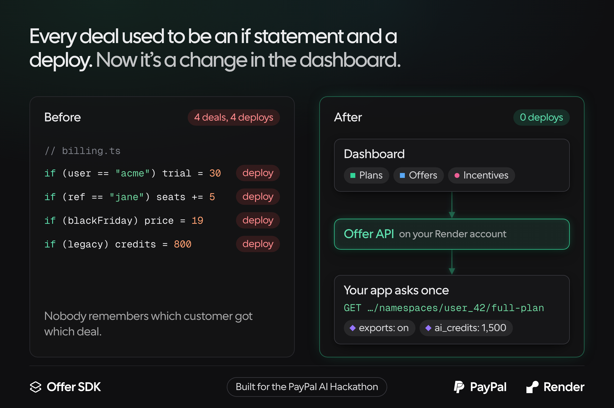

## What's in the box

A self-hosted billing and entitlement API, a headless React SDK and an admin dashboard. Deploy it to your own Render account in one click, connect your PayPal account, and from then on you change plans, access and prices in the dashboard instead of the code.

| | |
| --- | --- |
| **Plans and entitlements** | An entitlement is a yes or no (exports) or a number (AI credits, API calls). The API counts usage against the numbers, so you can charge by usage. |
| **Add-ons and incentives** | Add-ons are extras on top of a plan. An incentive overrides what one account gets: a promo, a partner deal, an affiliate package. |
| **Offers** | An offer sits on top of one or more plans. It can lower the price per interval, add entitlements and attach order bumps. Build the checkout page once, then give every ad, affiliate and email its own `?offer=` link. |
| **PayPal billing** | PayPal runs checkout and the whole subscription lifecycle: renewals, upgrades, downgrades, pauses and cancellations. Buyers pay the founder directly. |
| **Limits agents can read** | Over a blocking limit, the API answers with a `402` that carries a plain-language message, an upgrade offer and a checkout link. An AI agent can act on it without a human in the loop. |
| **Agentic cancel flows** | The team designs the cancel questions. At the offer step, an AI agent reads the account's plan, tenure, usage and reason for leaving, picks one save offer and writes the copy. The API checks it against the team's limits before the customer sees it. |
| **Dashboard agent** | Ask questions about usage and let it propose catalog changes. Every change waits for your approval. |
| **Webhooks and Zapier** | Every billing and customer event can fire a signed webhook or a Zap. |

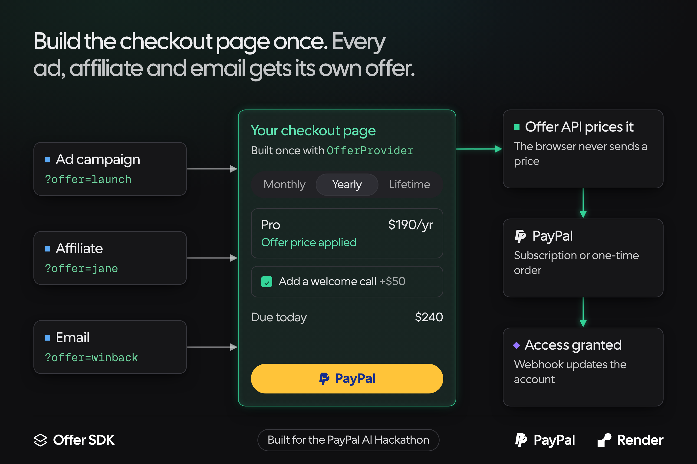

### A save, start to finish

A customer hits their credit limit three months running, then clicks **Cancel**. The agent skips the discount and offers **5,000 more credits at the same price**, because the problem was the limit, not the price. The server checks the offer against the team's guardrails, PayPal applies it, and the customer stays.

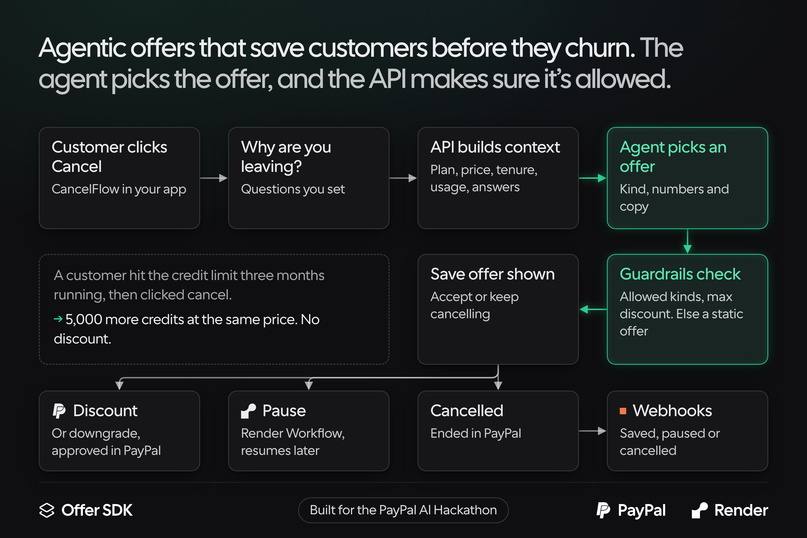

## Take the tour

Click **Explore the demo workspace** on [app.offersdk.com](https://app.offersdk.com/sign-in). It has two sample apps and six months of usage, so there's nothing to set up.

<table>
  <tr>
    <td width="50%">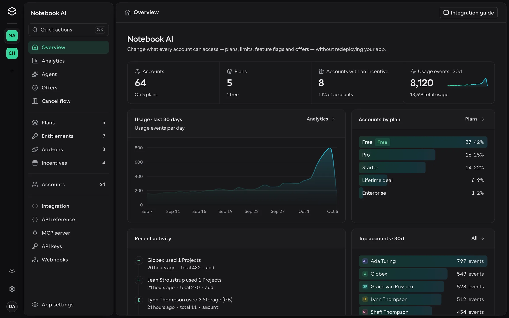<br><sub><b>Overview.</b> Revenue, signups and usage for one app.</sub></td>
    <td width="50%">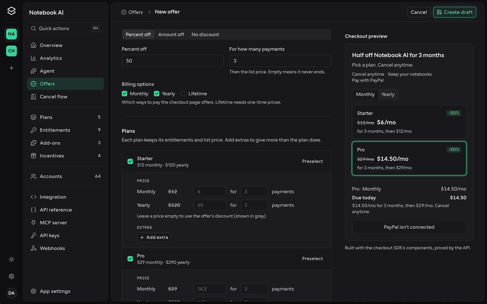<br><sub><b>Offers.</b> Price, extras and order bumps, sold from one <code>?offer=</code> link.</sub></td>
  </tr>
  <tr>
    <td>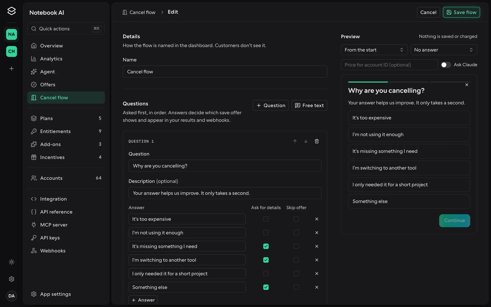<br><sub><b>Cancel flows.</b> Questions, steps and the limits the agent has to stay inside.</sub></td>
    <td>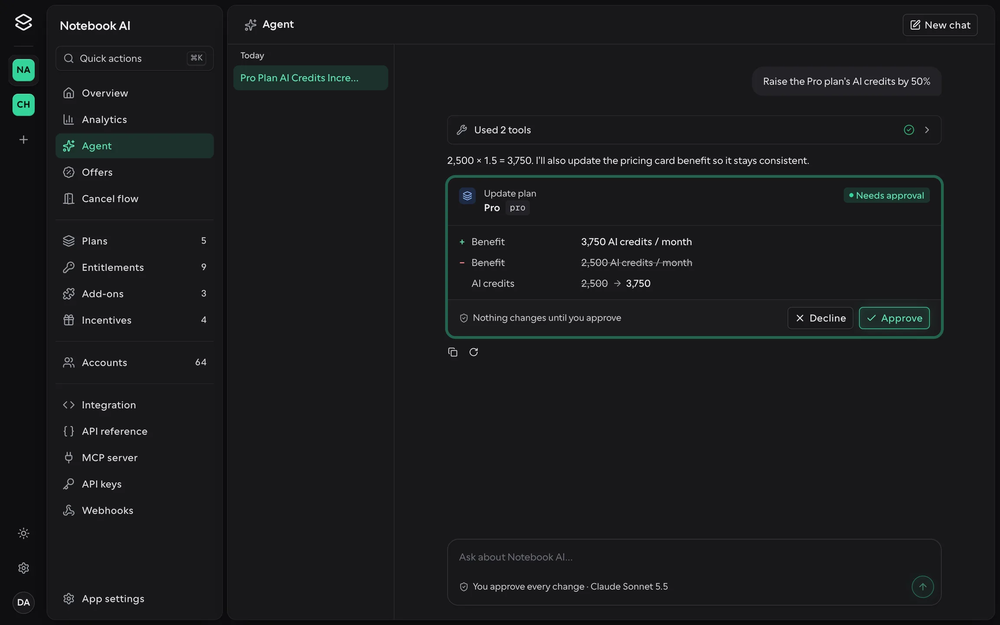<br><sub><b>Agent.</b> Proposes catalog changes and waits for your approval.</sub></td>
  </tr>
  <tr>
    <td>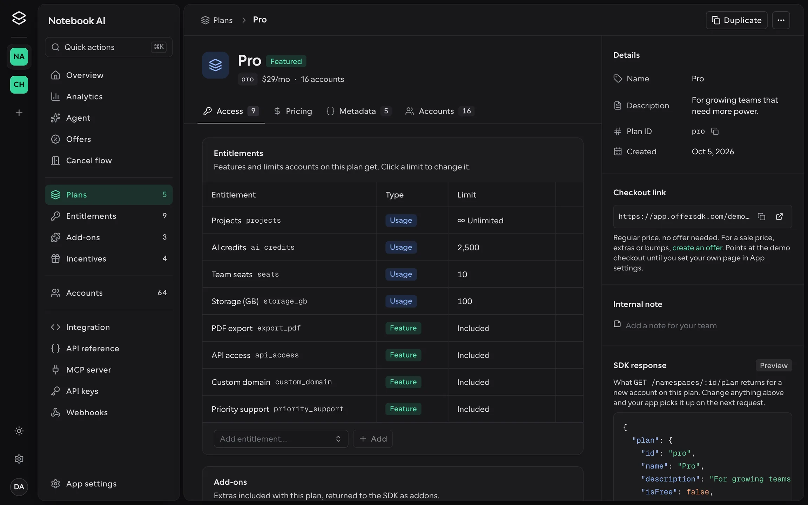<br><sub><b>Plans.</b> Prices per interval and the entitlements each plan grants.</sub></td>
    <td>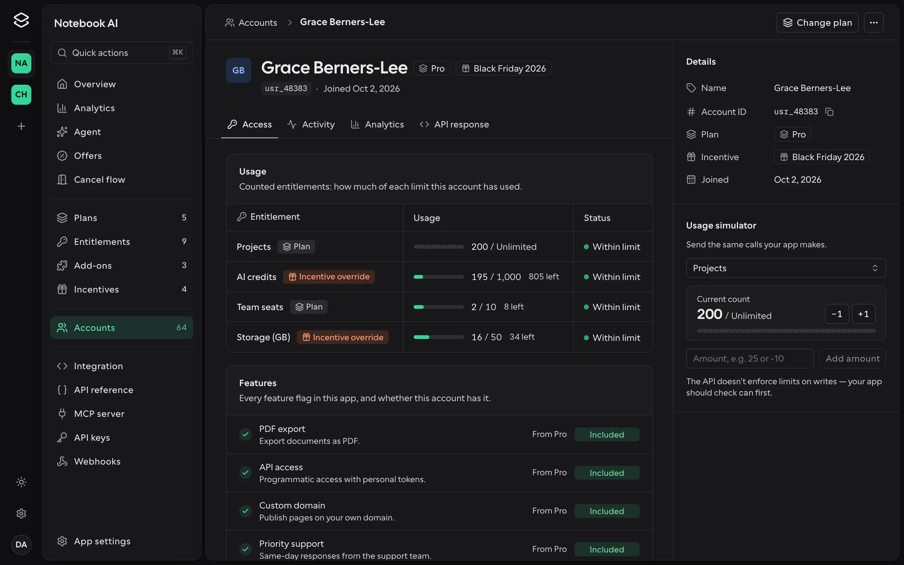<br><sub><b>Accounts.</b> One customer's plan, incentive and usage against every limit.</sub></td>
  </tr>
</table>

## The SDK in four snippets

**1. Ask what an account can do.** `full-plan` returns every entitlement already resolved, with current usage.

```bash
curl https://your-api.onrender.com/apps/$APP_ID/namespaces/user_42/full-plan \
  -H "Authorization: Bearer $OFFER_SECRET_KEY"
```

```json
{
  "plan": { "id": "pro", "name": "Pro" },
  "entitlements": [
    { "feature": "posts", "type": "usage", "usage": 2, "max": 100, "left": 98, "can": true },
    { "feature": "pin_posts", "type": "boolean", "can": true }
  ]
}
```

**2. Build checkout once.** `OfferProvider` and the `Offer.*` components sell whichever offer the link names, paid through PayPal. The browser never sends a price.

```tsx
<OfferProvider {...config} offerId={offer} account={user.id} onSuccess={() => router.push("/welcome")}>
  <Offer.Headline />
  <Offer.IntervalToggle labels={{ year: "Yearly (2 months free)" }} />
  <Offer.Plans>{(plan) => <Offer.Plan plan={plan} />}</Offer.Plans>
  <Offer.Bumps>{(bump) => <Offer.Bump bump={bump} />}</Offer.Bumps>
  <Offer.Summary />
  <Offer.Checkout style={{ color: "black", shape: "pill" }} />
</OfferProvider>
```

**3. Go over a limit, get an offer back.** A person or an agent can read this `402` and pay for the upgrade.

```json
{
  "error": "limit_reached",
  "message": "You've used 3 of 3 Posts on the Free plan. Pro includes 75 Posts for $4.50/month for 3 months, then $9/month. Upgrade here: …",
  "entitlement": { "id": "posts", "name": "Posts", "usage": 3, "max": 3 },
  "offer": { "id": "launch_50", "plan": { "id": "pro", "name": "Pro" }, "interval": "month", "price": 4.5, "checkout_url": "…" },
  "retry_after_purchase": true
}
```

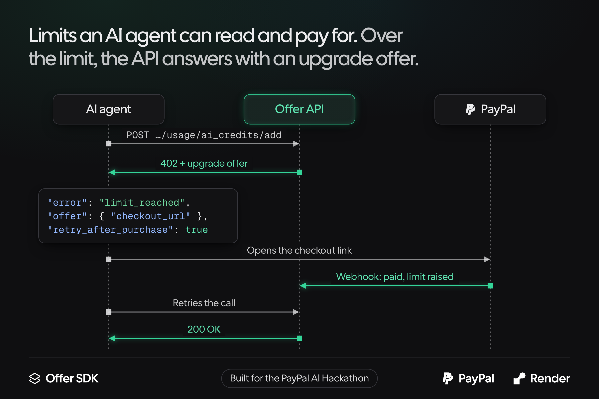

**4. Drop in a cancel flow.** Your server mints a signed account token for one customer; the agent does the rest.

```tsx
<CancelFlowProvider apiUrl={apiUrl} appId={appId} token={token} onSaved={() => router.refresh()}>
  <CancelFlow.Trigger>Cancel subscription</CancelFlow.Trigger>
  <CancelFlow.Dialog />
</CancelFlowProvider>
```

Every piece is headless, and the dashboard's live previews render through the same components. See [Checkout](https://offersdk.com/docs/sdk/checkout) and [Cancel flows](https://offersdk.com/docs/sdk/cancel-flows) for the full API.

## How access resolves

Every account stays on a core plan. The offer it bought through adds its extras, and an incentive goes on top. The SDK reads the result from one endpoint.

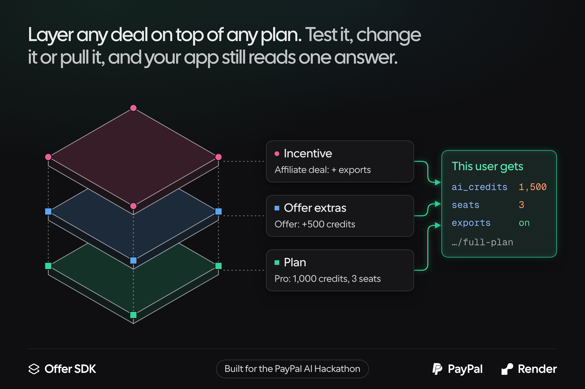

## Deploy on Render

<a href="https://render.com/deploy?repo=https://github.com/impactvelocity/offer-sdk"></a>

[`render.yaml`](render.yaml) is a Blueprint for the whole stack. One click creates four resources, wired together on the first deploy:

| Resource | What it is |
| --- | --- |
| `offersdk-api` | The Offer API (Hono on Bun, in Docker) |
| `offer-app` | The Next.js dashboard |
| `offersdk-workflows` | A Render Workflows service that runs subscription pauses |
| `offersdk-db` | Postgres 17, reachable only over the private network |

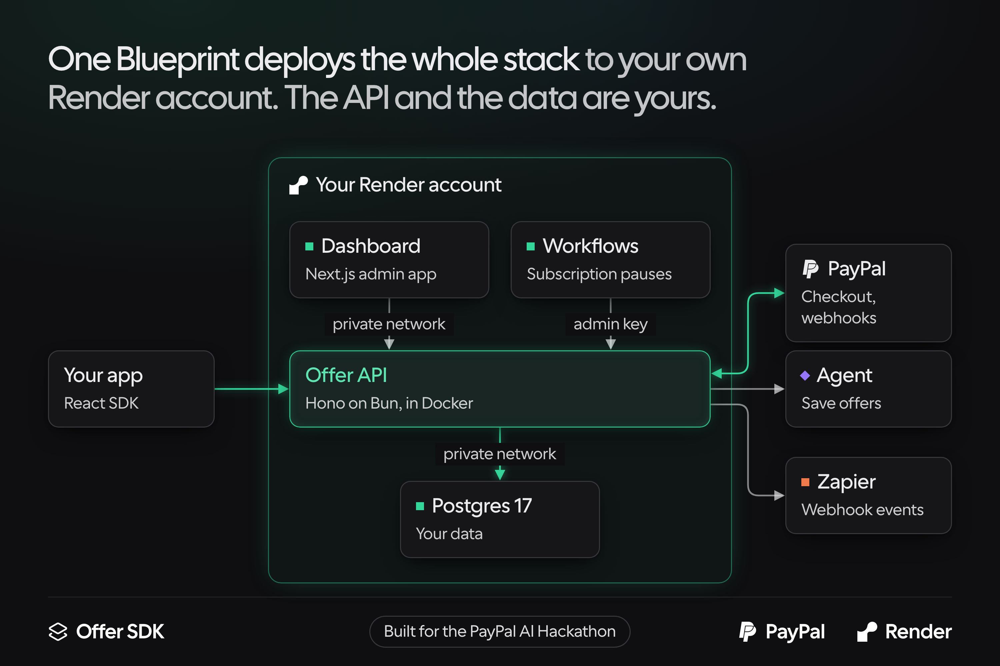

Because it all runs on your Render account, the API and every customer record belong to you. Render asks for a few values on the first deploy:

| Service | Variable | Value |
| --- | --- | --- |
| `offersdk-api` | `ADMIN_API_KEY` | A shared secret, e.g. `openssl rand -hex 32` |
| `offersdk-api` | `APP_URL` | The dashboard's public URL, e.g. `https://offer-app.onrender.com` |
| `offer-app`, `offersdk-workflows` | `OFFER_API_URL` | The API's public URL, e.g. `https://offersdk-api.onrender.com` |
| `offer-app`, `offersdk-api` | `ANTHROPIC_API_KEY` | Optional. Turns on the Agent page and dynamic save offers |
| `offersdk-api` | `RENDER_API_KEY` | Optional. Runs pauses on the Workflows service |

<details>
<summary><b>How the pieces talk to each other</b></summary>

```
browser ──► offer-app ── /api/admin/* (BFF) ──┐  Authorization: Bearer ADMIN_API_KEY
                      └─ /api/auth/*  (proxy) ─┴─► offersdk-api ──► Postgres
tenant code / SDK ───────────────────────────────► offersdk-api (app secret or public key)
offersdk-workflows ──────────────────────────────► offersdk-api (/pauses, admin key)
PayPal ──────────────────────────────────────────► offersdk-api (/paypal/webhooks/:appId)
```

- **Shared key.** `ADMIN_API_KEY` is set once on the API and copied to the dashboard as `OFFER_API_ADMIN_KEY`. The API rejects dashboard calls (`/orgs`, `/api/auth/*`, and any app as admin) without it.
- **Auth.** Users, sessions and workspaces are stored in Postgres by the API (`auth_*` tables). The dashboard forwards `/api/auth/*` to the API, so cookies are set on the dashboard's own domain. (`onrender.com` is a public suffix, so the two services can't share cookies any other way.)
- **URLs.** If you add custom domains later, update `APP_URL` and `OFFER_API_URL`. The dashboard reaches the API over Render's private network (`OFFER_API_INTERNAL_URL`, wired automatically).
- **Demo workspace.** The sign-in page offers **Explore the demo workspace** (`DEMO_ENABLED=true` in the blueprint). The first click builds the shared demo in the database, and `/demo-account` opens sign-in with the demo login filled in. The demo login is read-only. To build the demo ahead of time, run `pnpm seed:demo` with `APP_URL`. To rebuild it from scratch, add `--reset` and the API's `ADMIN_API_KEY` from Render.

  ```bash
  APP_URL=https://offer-app.onrender.com ADMIN_API_KEY=… pnpm seed:demo --reset
  ```

- **PayPal webhooks.** Each app connects its own PayPal account in the dashboard, and the API registers PayPal's webhook at that moment. On Render it uses the API's `onrender.com` address (`RENDER_EXTERNAL_URL`), so there's nothing to set. Set `PUBLIC_API_URL` on the API to register a custom domain instead, or when hosting elsewhere.
- **Secrets.** `BETTER_AUTH_SECRET` is generated on the API. Without `RENDER_API_KEY`, the API pauses and resumes subscriptions itself.

</details>

Full guide: [Deploy on Render](https://offersdk.com/docs/deploy) · [Environment variables](https://offersdk.com/docs/deploy/environment)

## Run it locally

You need Node 22+, pnpm 9 (`corepack enable`) and Docker. No `.env` files required.

```bash
git clone https://github.com/impactvelocity/offer-sdk
cd offer-sdk
pnpm install
pnpm dev:api      # Postgres + the API on :6767, in Docker
pnpm dev          # the dashboard (:6768), site (:6769) and demo app (:6770)
```

Open [localhost:6768](http://localhost:6768) and press **Explore the demo workspace**. The first click builds the demo login (`demo@offersdk.dev` / `demo-password`) with two sample apps and six months of usage; `pnpm seed:demo --reset` rebuilds it.

Local defaults line up out of the box: the API uses `localhost` Postgres and the admin key `dev-admin-key`, and trusts dashboard origins on any localhost port. Copy the `.env.example` files only to override something, such as adding `ANTHROPIC_API_KEY`.

> [!TIP]
> No Docker? Set `OFFER_API_URL=mock` in `offer-app/.env.local` to run the dashboard on an in-memory mock with a demo workspace.

## What's in the repo

A pnpm monorepo with three Next.js apps and a Workflows service, plus a standalone Bun API.

| App | Path | Port | What |
| --- | --- | --- | --- |
| `api` | [`api/`](api) | 6767 | **The Offer API** (Hono + Bun + Postgres): all data plus dashboard sign-in. Not part of the pnpm workspace; see [`api/README.md`](api/README.md) |
| `offer-app` | [`offer-app/`](offer-app) | 6768 | **The dashboard**, talking to the API through its BFF, plus the React SDK source (`src/sdk`) |
| `site` | [`site/`](site) | 6769 | Landing page and [docs](https://offersdk.com/docs) |
| `demo-app-testing` | [`demo-app-testing/`](demo-app-testing) | 6770 | **Test bed**: the Rails blog tutorial rebuilt on Next.js, using the API and SDK in every way, with a `rake test` console. See [`demo-app-testing/README.md`](demo-app-testing/README.md) |
| `workflows` | [`workflows/`](workflows) | | Render Workflows tasks for subscription pauses |

**Scripts**

- `pnpm dev`: run every workspace app
- `pnpm dev:api`: Postgres and the API, in Docker
- `pnpm dev:app` / `pnpm dev:site` / `pnpm dev:demo`: run one app
- `pnpm build`, `pnpm typecheck`, `pnpm lint`, `pnpm test`: run across all apps

## Docs

| Start here | Build with it | Run it |
| --- | --- | --- |
| [Quickstart](https://offersdk.com/docs/quickstart) | [React SDK](https://offersdk.com/docs/sdk) | [Deploy on Render](https://offersdk.com/docs/deploy) |
| [Core concepts](https://offersdk.com/docs/concepts) | [Checkout](https://offersdk.com/docs/sdk/checkout) | [Environment](https://offersdk.com/docs/deploy/environment) |
| [AI features](https://offersdk.com/docs/ai) | [Cancel flows](https://offersdk.com/docs/sdk/cancel-flows) | [Dashboard guide](https://offersdk.com/docs/admin) |
| [Project structure](https://offersdk.com/docs/structure) | [API reference](https://offersdk.com/docs/api/reference) | [Webhooks](https://offersdk.com/docs/api/webhooks) |

## Built with

- **[PayPal](https://offersdk.com/docs/sponsors/paypal)** takes every payment. Each app connects its own PayPal REST app; the API verifies it, stores the secret encrypted, prices every checkout from Postgres and grants access once, from the SDK or the webhook.
- **[Render](https://offersdk.com/docs/sponsors/render)** hosts the whole stack from one Blueprint, and Render Workflows run months-long subscription pauses without any task sleeping.
- **[Postman](https://offersdk.com/docs/sponsors/postman)** collection generated from the API's routes. A test fails if a route is missing from it.
- **[Zapier](https://offersdk.com/docs/sponsors/zapier)** connects through the same signed webhooks.
- **Claude** picks save offers with structured output. Plan and incentive ids are enums in the schema, so the agent can only name ones that exist, and the server re-checks every number.

## License

[MIT](LICENSE)

<p align="center"><sub>Built for the PayPal AI Hackathon. Your offers, your PayPal, your Render account.</sub></p>
